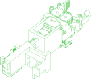
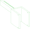

# CloudGripper Robot

The CloudGripper Robot is a project that includes 3D CAD models and electronics schematics.

It is designed to provide model filesand information on how to build the robot.
Documentation: [http://www.cloudgripper.org](http://www.cloudgripper.org)

Folder structure: The repository is structured as follows:
- Arm - Contains the .step and .stl CAD models for the robot arm.
- Drag_chain - Contains the .step and .stl CAD models for the robot's drag chain.
- Electronics_case - Contains the CAD model for the robot's electronics case.
- Robot - Contains the .step and .stl CAD models for the robot frame's parts.
- Gerber_PCB_controller.zip - Contains the Gerber files for electronic manufacturing.

## Assemblies

### Arm
<table><tr>
<td valign=top></td>
<td valign=top>The robot arm</td>
</tr></table>

## Parts

### Arm/Arm_grip_base

### Arm/Arm_grip_finger_right

### Arm/Arm_grip_finger_left

### Arm/Arm_grip_link2

### Arm/Arm_holder

### Arm/Arm_linear_gear

### Arm/Arm_linear_pinion_gear

### Arm/Arm_rotation_base

*Generated by [PartCAD](https://partcad.org/)*
